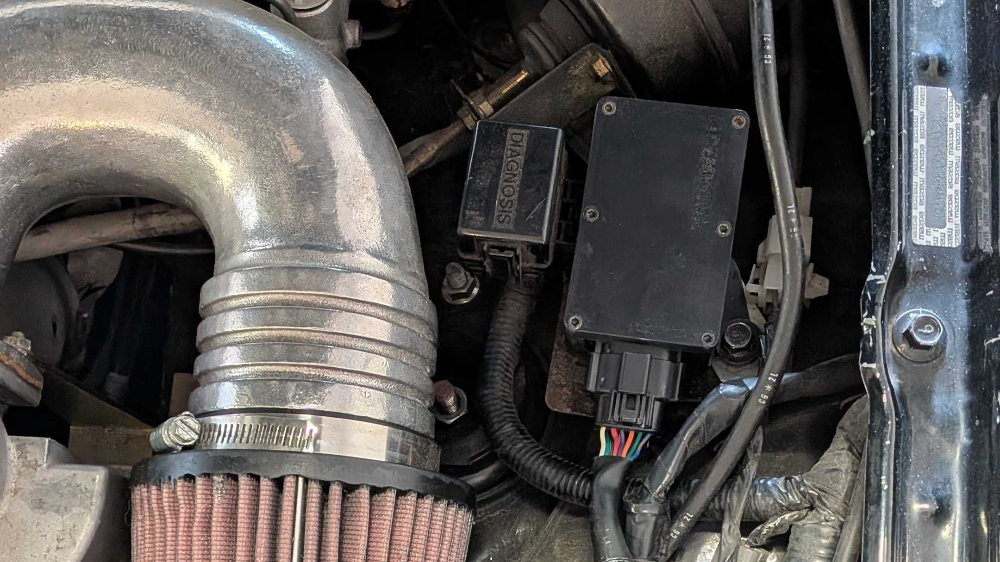

# OpenWink Headlight Mod
#### An Open Sourced pop up headlight controller for 1989 to 1997 Mazda MX5 Miatas

Control your Miata’s pop up headlights from a mobile app or customizable physical buttons. Wink, wave, blink, set sleepy eye positions, and create custom animation, all through the open source, plug and play controller and app.

[Getting Started](./docs/GETTING_STARTED.md) ·
[Installation Guide](./docs/INSTALLATION.md) ·
[Build Your Own](./docs/BUILD.md)

Join the Discord! 

> [!NOTE]
> OpenWink is under active development. The prebuilt app is currently available only on Android; downloadable on the [release page](https://github.com/seasaltsaige/openwink/releases). Preassembled modules will be available for purchase through Flyin' Miata in the future.

## Why choose OpenWink?

* **Plug and play installation:** Plugs into the factory headlight circuitry without cutting or splicing any wires.
* **App and physical button control:** Operate the headlights both through Bluetooth or assign actions to the OEM retractor button and optional auxiliary buttons.
* **Built in animations:** Your classic winks, blinks, waves, sleepy eye, and independent control for both headlights.
* **Custom commands:** Create and save your own headlight animation sequences.
* **Works without the app:** Your configured button actions are stored on the module for quick everyday use while driving.
* **Wireless firmware updates:** Download and install bug fixes and new features through the app without removing the module.
* **Completely open source:** Modify, repair, or contribute to the firmware, mobile app, update server, and [hardware design](https://github.com/pyroxenes/openwink-hardware-module).

## Compatibility
OpenWink is designed for **1989 to 1997 NA Mazda MX5 Miatas** with pop up headlights. 
Some features have only been confirmed to work on certain years. Help out by documenting feature functionality across different years!

## Where to start?

### Build your own Module
See the [build guide](./docs/BUILD.md), [firmware flashing guide](./docs/FLASHING.md), and the separate [hardware repository](https://github.com/pyroxenes/openwink-hardware-module).

### Install OpenWink
Start with the [installation guide](./docs/INSTALLATION.md) for compatibility information, required parts, wiring, setup, and safety notes.

### Make a Contribution
Read the [contribution guide](./.github/CONTRIBUTING.md), browse the [open issues](https://github.com/seasaltsaige/openwink/issues), or review the [project board](https://github.com/users/seasaltsaige/projects/1).

### Beta Testing
Join the [discord server](https://discord.gg/jaP67bgZBM) and ask about Beta Testing! We may send you a module to help find bugs and battle test new features as they release!

### Buy a premade Module
Check back in the near future! Coming soon...

## How It Works
OpenWink consists of three major components:

1. **[Wink Module:](https://github.com/pyroxenes/openwink-hardware-module)** An ESP32-S3 based controller board connected to the Miata’s headlight motor circuitry which monitors and sends out control signals to command headlight positions.
2. **Controller App:** A React Native based application that communicates with the module over [Bluetooth LE](https://en.wikipedia.org/wiki/Bluetooth_Low_Energy), allowing for longer range connection and control, with more reliable connectivity.
3. **Update Server:** Hosts and distributes firmware update information and binaries for over the air (OTA) updates, allowing for fixes and updates without module removal.

For a complete list of controls, settings, diagnostics, and customization options, see the [feature list](./docs/FEATURES.md).

  <h2 style="margin: 0;">Support the Project</h2>
  

If you would like, you can support the open source initiative for the project by [donating](https://buymeacoffee.com/seasaltsaige) to keep the it alive.

## Acknowledgements
- Special thanks to [pyroxenes](https://github.com/pyroxenes) for creating and iterating on the [PCB design](https://github.com/pyroxenes/openwink-hardware-module) and assembly.
- Project idea inspired by the MX5Tech Wink Mod.
- Initial prototypes inspired by this [Instructables tutorial](https://www.instructables.com/Popup-headlight-wink-with-arduino-and-relay-board-/).
- Initial prototype design/repository can be found [here](https://github.com/seasaltsaige/popup-wink-mod).

 

  <h2 style="margin: 0;">License</h2>
  

The [OpenWink Wink Mod](https://github.com/seasaltsaige/openwink) is free and open-source collection of software and hardware licensed under the [GPL-3.0 License](./LICENSE). 