# App Gallery
A collection of the current state of the compiled application.

## Navigation

- [Home Screen](#home-screen)
  - [Quick Links](#quick-links)
  - [Firmware Update](#)
  - [Default Commands](#default-commands)
  - [Custom Commands](#custom-command-view)
- [Settings](#settings)
  - [System Info](#system-info)
  - [Module Settings](#module-settings)
    - [Wave Delay](#wave-delay)
    - [Sleepy Eye](#sleepy-eye)
    - [Button Sequence](#custom-dash-button)
    - [Sleep/Unpair/Reset](#sleepunpairreset)
  - [App Theme](#app-theme)
## Home Screen
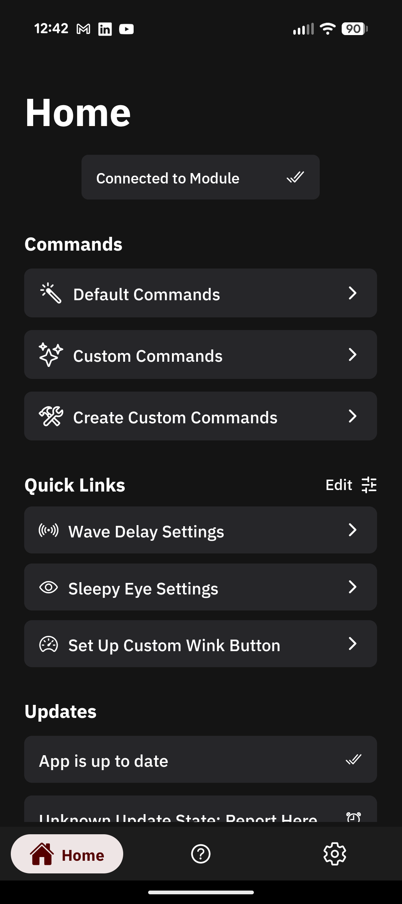

The main home screen in its default state, after connecting to the module.

### Quick Links
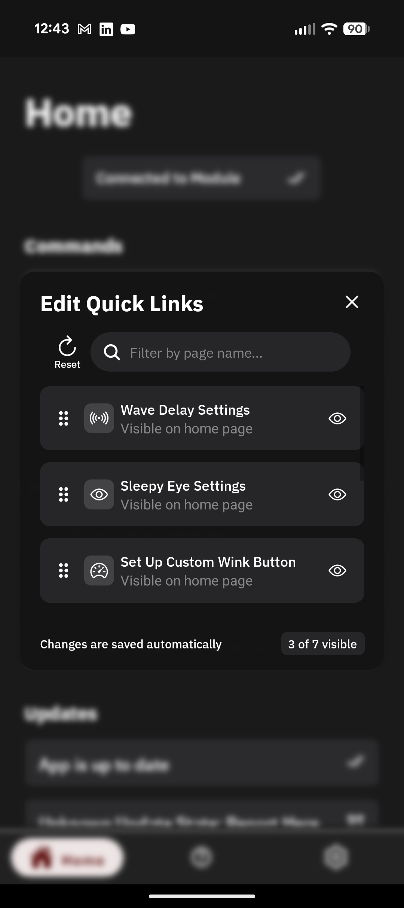

Quick Links display which allows the user to customize which settings pages are displayed on the home screen, which quickens navigation by avoiding 3+ clicks to find a setting; improving user experience.

### Firmware Update Panel
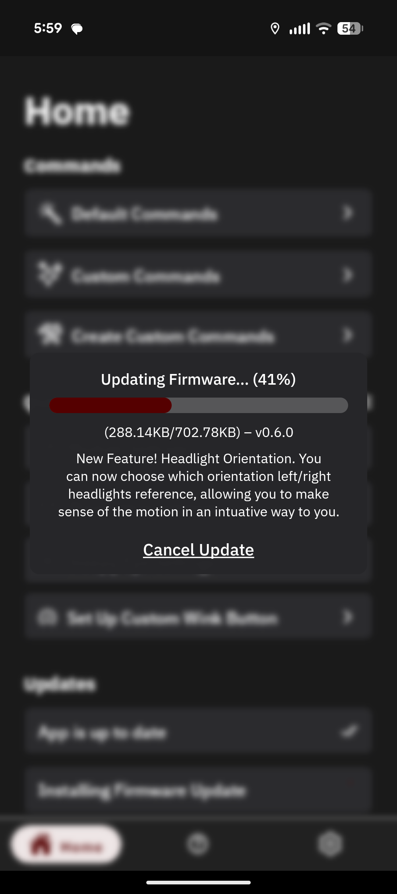

The firmware update panel will display while you are installing a firmware update on the Wink Module. It will display the current update status, version number, and a brief description of what was added/changed in the update.

### Default Commands
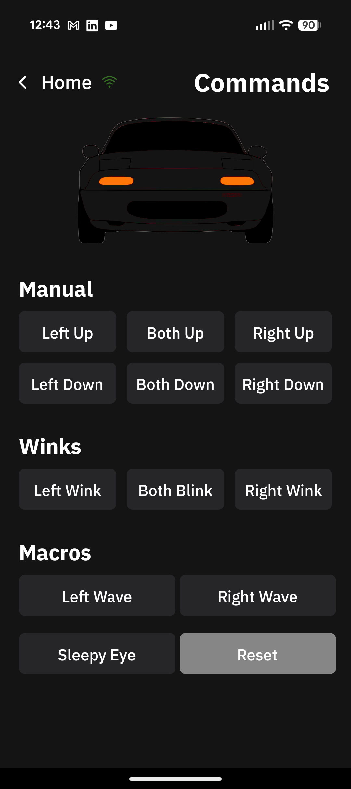
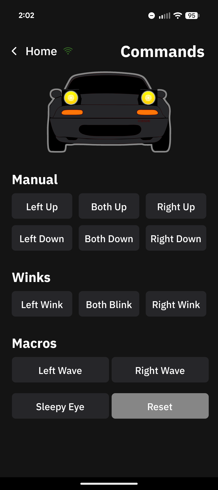

### Custom Command View
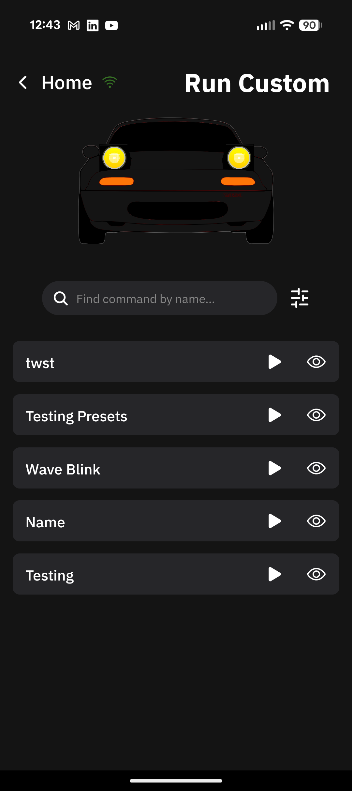
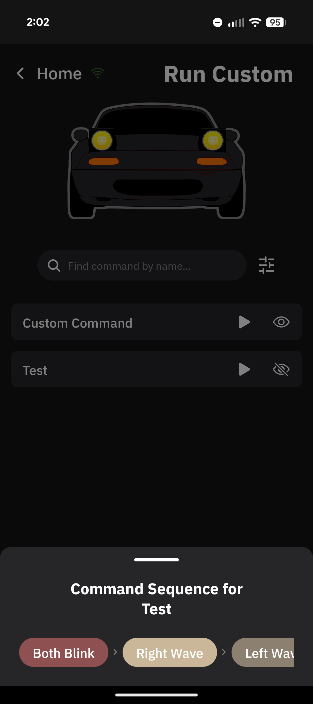

Custom Commands can be created and executed from the Custom Commands page, allowing you to save customized sequences of actions, saving you multiple button presses for long sequences that you enjoy. Quick view allows you to refresh your memory as well incase you forget.

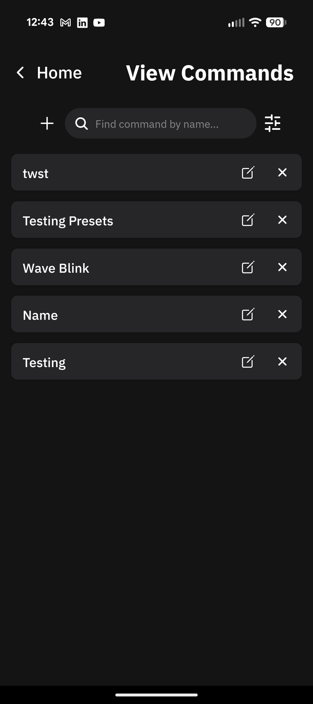
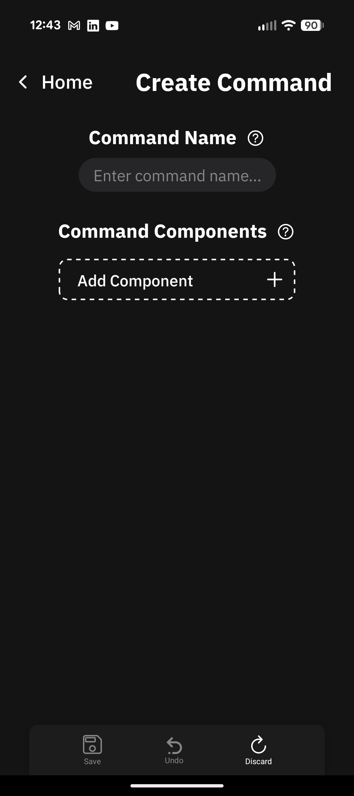
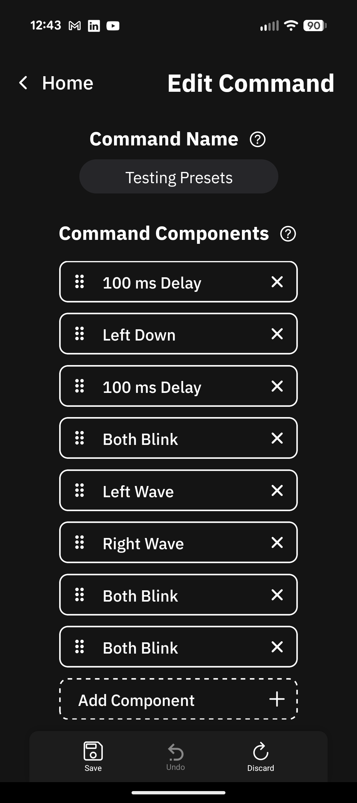

As mentioned previously, you are able to create and edit all of your custom commands through a fairly straight forward UI, allowing you to add components, drag them around to reorder, and add a memorable name.

## Settings
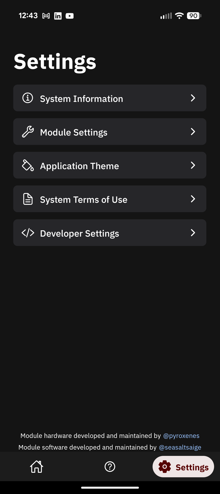

The main settings page; developer settings are only present in development build artifacts of the app.

### System Info
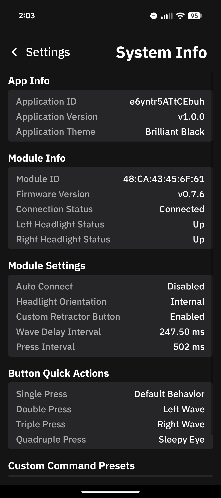

Displays all of the saved data on the app. All data can be erased through a reset, or manually deleting all settings through their corresponding UI panels.

### Module Settings
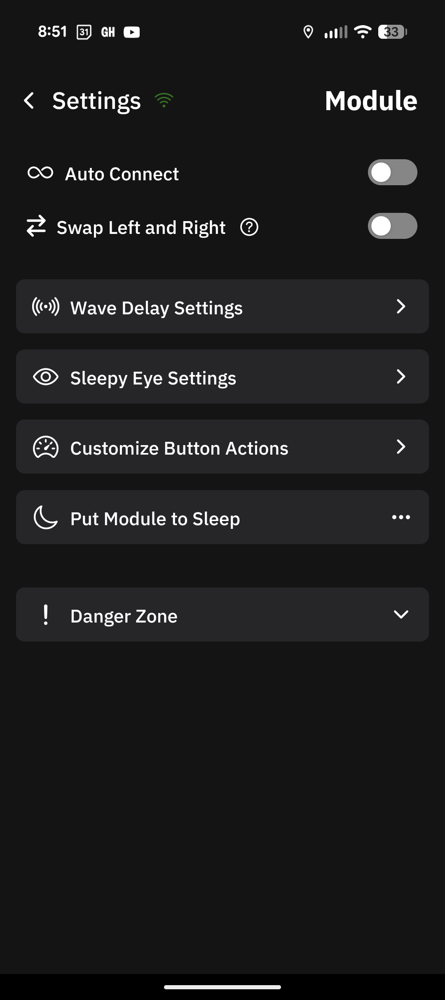

Settings page specific to the Module, where all the customizations live.

#### Wave Delay
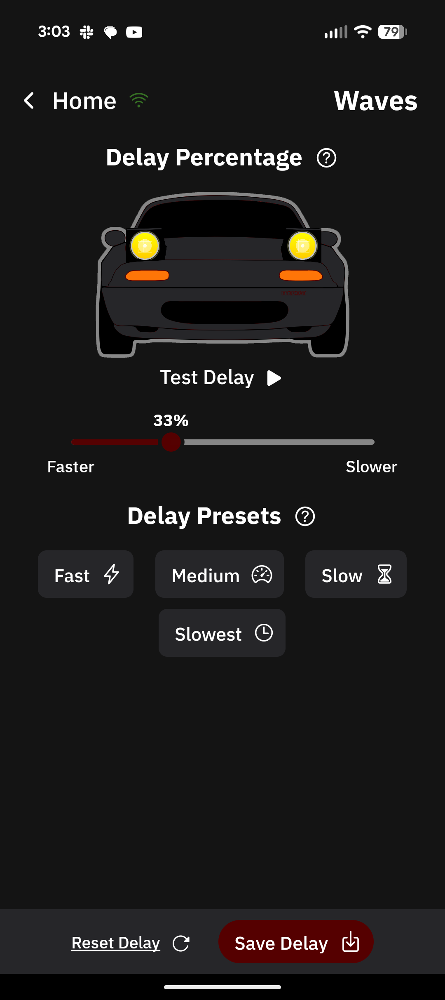

This page allows you to customize the percent delay for when the second headlight starts moving. The percentage is based on the length of time that it takes for a full retraction/extension. For example, 33% would allow the first headlight to move 33% of the way, then begin moving the second headlight.

#### Sleepy Eye
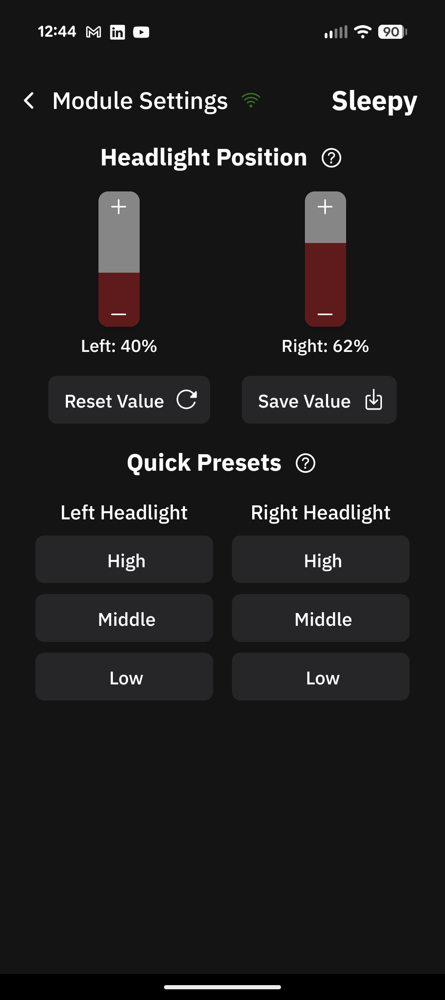

This page allows you to customize the precise positioning of each headlight while in 'Sleepy Eye' mode. Both headlights are individually settable, from 0% raised to 100% raised. The relative percentage is based on how far up it will be raised from retracted; ie: 25% means slightly raised, 50% is half-way, and 75% is almost fully up.

#### Custom Dash Button
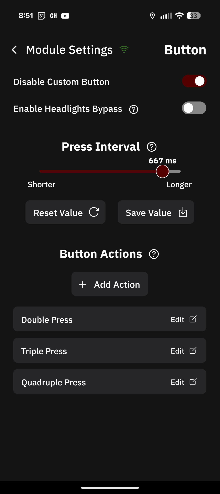
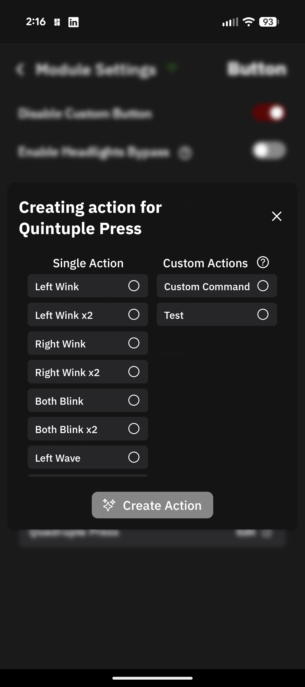

This page allows customization of the oem dash button behaviors. By default, the setting is not enabled, but can easily be turned on as seen in the image. Additionally, I have added a setting which allows you to get around the limitation which MX-5 Tech claims prevents you from opperating the headlights with the dash button while your lights are turned on. This setting can potentially be dangerous at night, so use it with caution. If option is turned on, but the main setting is turned off, this does nothing. 

You are also able to customize the delay between button presses, allowing you to tune how fast you need to press the button in order to activate a sequence. A shorter time means faster activation when you reach your count, but you need to be quicker. A longer time is the opposite, more delay when done pressing, but more lenient.

Lastly, you are able to assign predefined actions from the list labeled 'Single Action', or you can create a Custom Command [(in the page mentioned previously)](#custom-command-view), then assign said command through the list labeled as 'Custom Actions', allowing you to use your custom sequences without the need of your app being open.

#### Sleep/Unpair/Reset
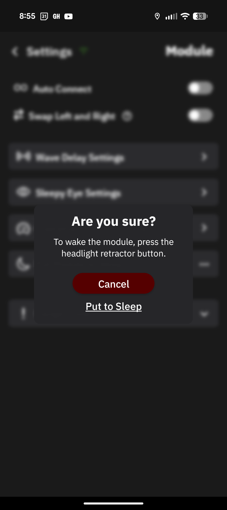

**Deep Sleep:** By default, the module will go into deep sleep for ~15 seconds, wake up, advertise itself for ~1 second, the go back to sleep. While this attempts to maximize your battery life, if the car is sitting for a long period of time, (>> 1 week), then the module can be put into deep sleep, where the only ways to wake the module are either a) Pressing the dash button, or b) Unplugging then re-connecting the module.

**Unpair:** Once connected to a module, your phone will bind with said module, and the module will bind with your phone. This will disallow other connections, either from your phone to a different module, or your module to a different phone. To reset this to factory settings, you are able to unpair from the module. 
- Additionally, if you happen to change phones, and need to connect a new phone to a module that has not been unpaired through the app, you are able to execute the reset press sequence, and it will perform the same thing, as described, but only for the module.

**Reset:** Reset is more destructive than Unpairing. Resetting the device will restore all settings to their factory defaults, along with unpairing from the module.

### App Theme
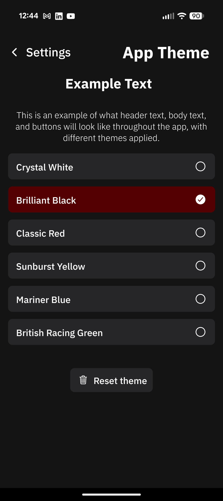

The app comes in dark theme by default, specifically 'Brilliant Black' (which is my cars color), which has a black exterior and red interior. All of the other color themes relate to NA Miata color combos. Crystal White is the light theme, being white and tan. The rest are dark themes.