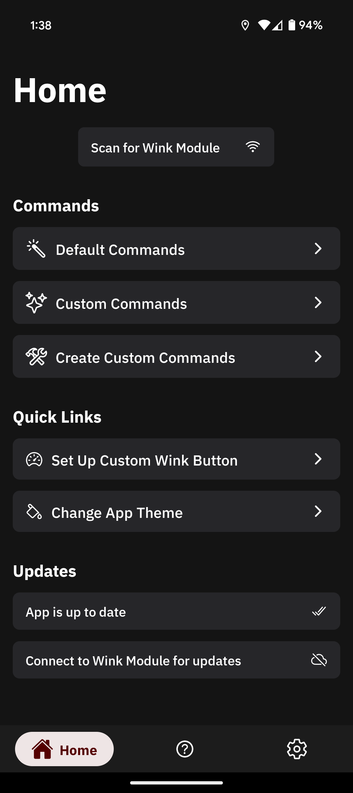

<div align="center">

# Wink Module Remote App

This directory contains the code base which serves as the remote for the Wink Module system. The app communicates over Bluetooth Low Energy, allowing for long range communication compared to other counterparts.

[](https://www.typescriptlang.org/)
[](https://reactnative.dev/)
[](https://docs.expo.dev/)

</div>

# Table of Contents
- [App Preview](#app-preview)
- [Core Libraries](#core-libraries-used)
- [Getting Started](#getting-started)
  - [Development](#creating-a-development-artifact)
  - [Preview](#creating-a-preview-artifact)
- [About the App](#about-the-app)
- [Contributing](#contributing)
  - [Vulnerabilities](#vulnerabilities)

## App Preview



## Core Libraries Used
```bash
> react-native
> expo
> expo-font
> @react-navigation/bottom-tabs
> @react-navigation/native-stack
> react-native-ble-plx
> react-native-wifi-reborn
```
This react native project is managed by Expo and EAS, allowing for quicker development using the expo-dev-client. Bluetooth Low Energy and WiFi functionality is provided through `react-native-ble-plx` and `react-native-wifi-reborn` respectively.

## Getting Started


### Creating a development artifact
Due to the fact that this project utilizes native components, such as WiFi and BLE, Expo Go can not be used, and a development build must be created.

Clone this repository and  ensure you are in the correct directory.
```bash
> git clone https://github.com/seasaltsaige/openwink.git
> cd ./openwink/openwink-app
```
Ensure that you have all the relevant packages installed.
```bash
> npm install -g expo # Install expo globally
> npx expo install # Install relevant project packages
> npm install -g eas-cli # Install global EAS CLI build tools
```
Check to ensure that your `eas.json` file contains a `development` build key.
```json
    //...
    "development": {
      "developmentClient": true,
      "distribution": "internal",
      "ios": {
        "simulator": true
      }
    },
    //...
```
Make sure you have an [expo.dev](https://expo.dev/) account, and you log into it using the [eas-cli](https://github.com/expo/eas-cli?tab=readme-ov-file#eas-accountlogin).

Create a new project in [Expo](https://expo.dev/).

Login with eas-cli
```bash
> eas login
```

Create a `.env` file from the `.env.template` and fill in your variables.
```bash
# Won't overwrite if .env already exists
> cp -n .env.template .env
```

Initialize the project
```bash
> eas init
```

Start your build
```bash
> eas build:dev --profile development --platform [ios|android]
```
Once the build finishes, you will receive a QR code to install the build artifact on your device. Once you do so, you will need to start the development server on your laptop/desktop. Ensure you are connected to the same network on both devices, otherwise you will be unable to connect to the development server.

```bash
> npx expo start --dev-client
```

Happy Coding!


### Creating a development build for iOS without a developer account
If you don't have an Apple Developer account, you can still build and test the app on your iOS device using your personal Apple ID. This method requires manual configuration in Xcode but allows you to develop without the $99/year developer program.

**Prerequisites**: Ensure you have completed the initial setup steps from [Creating a development artifact](#creating-a-development-artifact), including installing dependencies and configuring your project.

Generate the native iOS project files using Expo's prebuild command.
```bash
> npx expo prebuild --platform ios
```

Navigate to the iOS directory and install CocoaPods dependencies.
```bash
> cd ios
> npx pod-install
```
**Important**: Always use `npx pod-install` instead of `pod install` directly, as this prevents conflicting pod definitions.

Return to the project root and open the Xcode workspace.
```bash
> cd ..
> open ios/openwinkapp.xcworkspace
```

**Configure Signing in Xcode**:
1. In Xcode's project navigator (left sidebar), select **openwinkapp**.
2. Navigate to the **Signing & Capabilities** tab.
3. Under **Team**, select your personal Apple ID team.
4. Remove the **WiFi** and **Hotspot** capabilities, as these require a paid Apple Developer account.

Build and install the app on your connected iOS device.
```bash
# In Xcode, press Cmd+B or select Product > Build
```

Once the build completes and installs on your device, start the Expo development server.
```bash
> npx expo start --dev-client
```

Your device should now connect to the development server. Ensure both your computer and iOS device are on the same network.

Happy Coding!


### Creating a preview artifact
A preview artifact acts similar to the distribution build, used when deployed to the corresponding app store. The preview build does not contain development tools, and serves as a functional build of the app that can be used offline.

I will assume that you have all the prerequisites mentioned in [Creating a development artifact](#creating-a-development-artifact) completed, and all related packages installed.

Check to ensure that your `eas.json` file contains a `preview` build key.
```json
    //...
    "preview": {
      "distribution": "internal"
    },
    //...
```
Start your build
```bash
> eas build --profile preview --platform [ios|android]
```
Once the build finishes, you will receive a QR code to install the build artifact on your device.

Happy Winking!


## About the App
This is an Expo managed React Native application. Utilizing expo has increased productivity significantly due to the increased speed of feedback thanks to the development client build distribution.

### File Structure
```bash
winkduino-app
│
├── assets # Contains all image assets used in the app
│   ├── adaptive-icon.png
│   ├── favicon.png
│   ├── icon.png
│   └── splash-icon.png # All icons need updating: See issue #20
├── Components # Contains components used throughout the app
│   ├── HeaderWithBackButton.tsx
│   ├── index.ts
│   ├── LongButton.tsx
│   ├── MainHeader.tsx
│   └── TooltipHeader.tsx
├── helper # Contains helper functions and constants
│   ├── Constants.ts
│   ├── Functions.ts
│   └── Types.ts
├── hooks # Custom hooks used to communicate BLE status and App Theming 
│   ├── useBLE.ts
│   ├── useColorTheme.ts
│   └── useErrorHandler.ts
├── Pages # The main page routes of the app
│   ├── Home
│   │   ├── CreateCustomCommand.tsx
│   │   ├── CustomCommands.tsx
│   │   ├── Home.tsx
│   │   └── StandardCommands.tsx
│   ├── Settings
│   │   ├── ModuleSettings
│   │   │   ├── CustomWinkButton.tsx
│   │   │   ├── ModuleSettings.tsx
│   │   │   ├── SleepyEyeSettings.tsx
│   │   │   └── WaveDelaySettings.tsx
│   │   ├── AppTheme.tsx
│   │   ├── Information.tsx
│   │   ├── Settings.tsx
│   │   └── TermsOfUse.tsx
│   ├── HowToUse.tsx
│   └── index.ts
├── Providers # Used in conjunction with `hooks` to provide said data
│   ├── BleProvider.tsx
│   └── ThemeProvider.tsx # See issue #21
├── Storage # Helper class functions that interface with AsyncStorage (see issue #7)
│   ├── AutoConnectStore.ts
│   ├── CustomCommandStore.ts
│   ├── CustomOEMButtonStore.ts
│   ├── CustomWaveStore.ts
│   ├── DeviceMACStore.ts
│   ├── FirmwareStore.ts
│   ├── index.ts
│   ├── SleepyEyeStore.ts
│   └── ThemeStore.ts
├── app.json # Contains Expo app information for build artifacts
├── App.tsx # Root view
├── eas.json 
├── index.ts # App entry point
├── Navigation.tsx # Contains all navigation core functionality
├── package-lock.json
├── package.json
├── README.md # You're here!
└── tsconfig.json
```

## Contributing
Contributions are always welcome and encouraged! If you have an idea for the app that you would like to see, or perhaps a bug report, feel free to open an issue and get it reviewed! Please refer to the [Contribution Guidelines](../docs/CONTRIBUTING.md) and the [Code of Conduct](../docs/CODE_OF_CONDUCT.md) first.

### Vulnerabilities
Please report any vulnerabilities directly to us [here](https://miatawink.tech/contact) or at our email [miatawinktech@gmail.com](mailto:miatawinktech@gmail.com). Due to the nature of vulnerabilities, we ask that you do not post issues about them; avoiding bringing them to public attention.