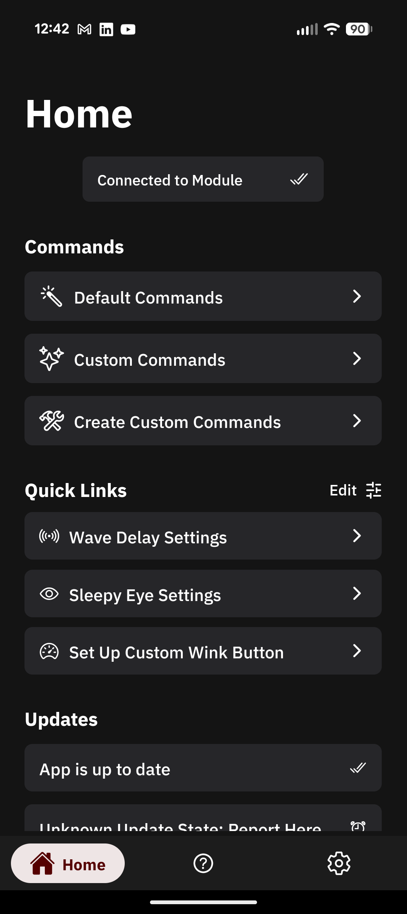

<div align="center">

# Wink Module Remote App

This directory contains the controller application for the OpenWink module system. The app communicates with the Wink Module over Bluetooth Low Energy, providing a modern control center for Miata pop-up headlight commands, custom animations, module settings, OTA firmware updates, and system diagnostics.

[](https://www.typescriptlang.org/)
[](https://reactnative.dev/)
[](https://docs.expo.dev/)

</div>

# Table of Contents
- [App Preview](#app-preview)
- [Core Libraries](#core-libraries-used)
- [Getting Started](#getting-started)
  - [Development](#creating-a-development-artifact)
    - [iOS Development](#creating-a-development-build-for-ios-without-a-developer-account)
  - [Preview](#creating-a-preview-artifact)
- [About the App](#about-the-app)
- [Contributing](#contributing)
  - [Vulnerabilities](#vulnerabilities)

## App Preview


See more about the current state of the app in the app [Gallery](../docs/media/app/gallery.md)!

## Core Libraries Used
```bash
> react-native
> expo
> expo-font
> expo-blur
> @react-navigation/bottom-tabs
> @react-navigation/native-stack
> react-native-ble-plx
```

This React Native project is managed with Expo and EAS, allowing for faster iteration through Expo development builds. Bluetooth Low Energy functionality is provided through `react-native-ble-plx`.

## Getting Started

For broader project build instructions, pre-built application installation, and custom build artifact information, see the main [Build Guide](../docs/build/BUILD.md).

### Creating a development artifact
Due to the fact that this project utilizes native components, such as WiFi and BLE, Expo Go can not be used, and a development build must be created.

Clone this repository and ensure you are in the correct directory.

```bash
> git clone https://github.com/seasaltsaige/openwink.git
> cd ./openwink/openwink-app
```

Ensure that you have all the relevant packages installed.

```bash
> npm install -g expo # Install expo globally
> npx expo install # Install relevant project packages
> npm install -g eas-cli # Install global EAS CLI build tools
```

Check to ensure that your `eas.json` file contains a `development` build key.

```json
    //...
    "development": {
      "developmentClient": true,
      "distribution": "internal",
      "ios": {
        "simulator": true
      }
    },
    //...
```

Make sure you have an [expo.dev](https://expo.dev/) account, and you log into it using the [eas-cli](https://github.com/expo/eas-cli?tab=readme-ov-file#eas-accountlogin).

Create a new project in [Expo](https://expo.dev/).

Login with eas-cli.

```bash
> eas login
```

Create a `.env` file from the `.env.template` and fill in your variables.

```bash
# Won't overwrite if .env already exists
> cp -n .env.template .env
```

Initialize the project.

```bash
> eas init
```

Start your build.

```bash
> eas build:dev --profile development --platform [ios|android]
```

Once the build finishes, you will receive a QR code to install the build artifact on your device. Once you do so, you will need to start the development server on your laptop/desktop. Ensure you are connected to the same network on both devices, otherwise you will be unable to connect to the development server.

```bash
> npx expo start --dev-client
```

Happy Coding!

### Creating a development build for iOS without a developer account
If you don't have an Apple Developer account, you can still build and test the app on your iOS device using your personal Apple ID. This method requires manual configuration in Xcode but allows you to develop without the $99/year developer program.

**Prerequisites**: Ensure you have completed the initial setup steps from [Creating a development artifact](#creating-a-development-artifact), including installing dependencies and configuring your project.

Generate the native iOS project files using Expo's prebuild command.

```bash
> npx expo prebuild --platform ios
```

Navigate to the iOS directory and install CocoaPods dependencies.

```bash
> cd ios
> npx pod-install
```

**Important**: Always use `npx pod-install` instead of `pod install` directly, as this prevents conflicting pod definitions.

Return to the project root and open the Xcode workspace.

```bash
> cd ..
> open ios/openwinkapp.xcworkspace
```

**Configure Signing in Xcode**:
1. In Xcode's project navigator, select **openwinkapp**.
2. Navigate to the **Signing & Capabilities** tab.
3. Under **Team**, select your personal Apple ID team.
4. Remove the **WiFi** and **Hotspot** capabilities, as these require a paid Apple Developer account.

Build and install the app on your connected iOS device.

```bash
# In Xcode, press Cmd+B or select Product > Build
```

Once the build completes and installs on your device, start the Expo development server.

```bash
> npx expo start --dev-client
```

Your device should now connect to the development server. Ensure both your computer and iOS device are on the same network.

Happy Coding!

### Creating a preview artifact
A preview artifact acts similar to the distribution build used when deployed to the corresponding app store. The preview build does not contain development tools, and serves as a functional build of the app that can be used offline.

For more detailed preview, custom build, and pre-built artifact information, see the main [Build Guide](../docs/build/BUILD.md).

I will assume that you have all the prerequisites mentioned in [Creating a development artifact](#creating-a-development-artifact) completed, and all related packages installed.

Check to ensure that your `eas.json` file contains a `preview` build key.

```json
    //...
    "preview": {
      "distribution": "internal"
    },
    //...
```

Start your build.

```bash
> eas build --profile preview --platform [ios|android]
```

Once the build finishes, you will receive a QR code to install the build artifact on your device.

Happy Winking!

## About the App
This is an Expo managed React Native application. Utilizing Expo has increased productivity significantly due to the increased speed of feedback thanks to the development client build distribution.

The app is designed to act as the main control center for the OpenWink module. It provides direct headlight controls, custom command creation, module settings, firmware updates, physical button configuration, live headlight status, and diagnostic visibility into the connected module.

Current app capabilities include:

- **BLE Module Connection**: Scan for, connect to, and communicate with the Wink Module using Bluetooth Low Energy.
- **Pairing and Reconnection**: Store the module-generated pairing key locally to allow only the paired device to reconnect.
- **Auto Connect**: Optionally reconnect to the saved Wink Module automatically.
- **Default Commands**: Run common headlight actions such as left/right/both up, down, wink, blink, and wave.
- **Manual Control**: Independently raise or lower the left headlight, right headlight, or both headlights.
- **Live Headlight Status**: Display and animate the Miata's headlight state in near real time as commands are executed.
- **Sleepy Eye Settings**: Configure sleepy-eye behavior with per-headlight control.
- **Wave Delay Settings**: Adjust delay timing between left and right headlight movement for wave-style animations.
- **Custom Commands**: Create, save, edit, and run custom command sequences.
- **Macro Looping**: Configure supported custom commands to loop until cancelled.
- **Quick Links**: Customize which frequently used pages appear on the home screen.
- **OEM Retractor Button Actions**: Assign custom actions to sequential OEM retractor button presses.
- **Auxiliary Button Actions**: Configure additional physical button inputs, including action assignment, momentary/latching behavior, and macro looping where supported.
- **Module Settings**: Manage auto-connect behavior, headlight perspective, press interval, headlight bypass behavior, and related module configuration.
- **System Information and Diagnostics**: View app version, firmware version, module ID, connection status, headlight positions, movement timing, saved settings, button mappings, and custom command presets.
- **Headlight Movement Timing**: Monitor left and right headlight movement times, which can help assess motor behavior and spot potential mechanical or electrical issues over time.
- **OTA Firmware Updates**: Update the Wink Module firmware through the app using the OpenWink update server.
- **Module Recovery Tools**: Forget a module, delete saved module settings, or put the module to sleep.
- **Application Themes**: Customize the app appearance with Miata-inspired themes.
- **System Profiles**: Manage app/module configuration profiles for different use cases.

### File Structure

```bash
openwink-app
├── assets/        # Static images, icons, splash assets, and app media
├── Components/    # Shared reusable UI components
├── Pages/         # Main app screens and route-level views
├── Plugins/       # Native/plugin related project code
├── Providers/     # Context providers for BLE, commands, updates, and theming
├── Storage/       # Local storage helpers for app and module settings
├── helper/        # Shared helper functions, constants, handlers, and types
├── hooks/         # Custom React hooks used throughout the app
├── .env.template  # Template environment variable file. Rename to '.env' to use
├── App.tsx        # Root app component
├── Navigation.tsx # Main navigation configuration
├── app.config.ts  # Expo app configuration
├── eas.json       # EAS build profiles
└── package.json   # Project scripts and dependencies
```

## Contributing
Contributions are always welcome and encouraged! If you have an idea for the app that you would like to see, or perhaps a bug report, feel free to open an issue and get it reviewed! Please refer to the [Contribution Guidelines](../docs/CONTRIBUTING.md) and the [Code of Conduct](../docs/CODE_OF_CONDUCT.md) first.

### Vulnerabilities
Please report any vulnerabilities directly to us [here](https://discord.gg/jaP67bgZBM) or at our email [miatawinktech@gmail.com](mailto:miatawinktech@gmail.com). Due to the nature of vulnerabilities, we ask that you do not post issues about them; avoiding bringing them to public attention.
